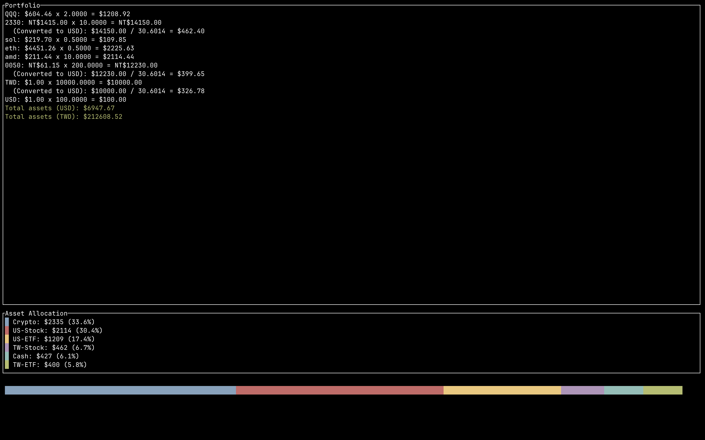

# price

This is a program that calculates the price of all your stocks/ETFs/cryptos in your portfolio.

## Features

- Get your total portfolio value in any currency

## Usage

In the config/ dir. You can add a `portfolio.toml` to create your assets list.

### Example

`config/portfolio.toml` required

This toml file is used to store your portfolio. You can add as many assets as you want. The program will automatically fetch the price of each asset and calculate the total value of your portfolio in the target currencies.

```toml
[US-Stock]
amd = 10

[US-ETF]
QQQ = 2

[TW-Stock]
2330 = 10

[TW-ETF]
0050 = 200

[Crypto]
eth = 0.5
sol = 0.5

[Forex]
USD = 100
TWD = 10000
```

`config/api_key.toml` optional

This file is used to store your API keys. You can add as many API keys as you want. The program will automatically fetch the price of each asset and calculate the total value of your portfolio in the target currencies.

```toml
"alpha_vantage_api_key" = "XXXXXXXXXXXXXXXX"
"exchangerate_api_key" = "xxxxxxxxxxxxxxxxxxxxxxxx"
```

`config/target_forex.toml` optional

This file is used to store your target currencies. You can add as many target currencies as you want. The program will automatically fetch the price of each asset and calculate the total value of your portfolio in the target currencies.

Default is USD.

```toml
target = "TWD"
```

## Demo



## Development

### Progress

- [X] Fetch stock prices
- [X] Fetch ETF prices
- [X] Fetch crypto prices
- [X] Fetch forex prices
- [X] Calculate total portfolio value in USD
- [ ] target forex calculation
- [X] alpha_vantage API
- [X] binance API
- [X] exchange_rate API
- [X] pyth(pyth network) API
- [X] redstone API
- [X] yahoo finance API
- [x] TWSE API

#### Ratatui

- [x] Basic layout
- [x] Portfolio table
- [x] Portfolio value
- [x] Colors
- [x] Charts

## Stats


