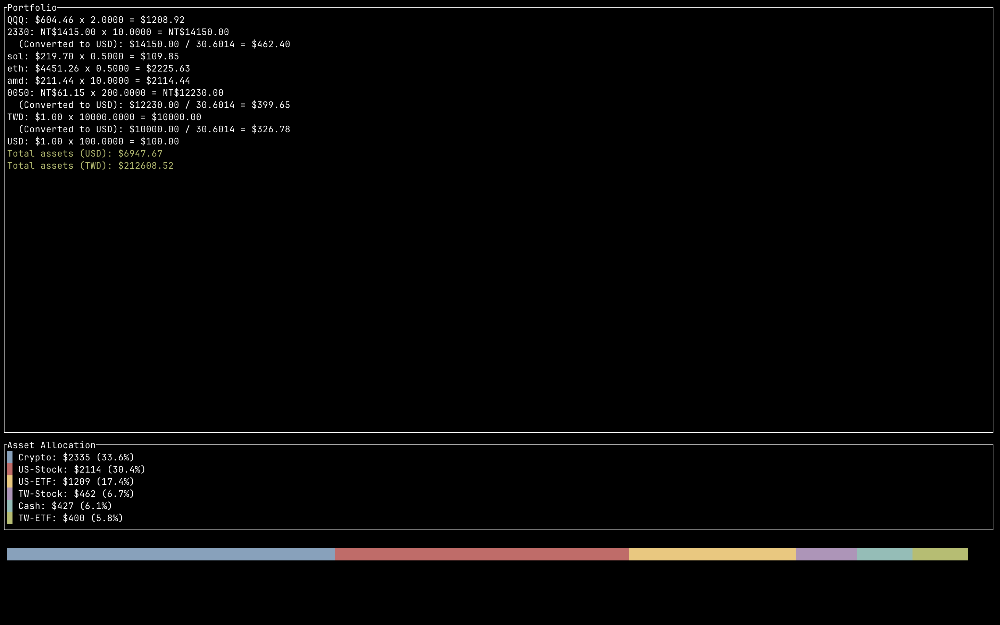

# price

This is a program that calculates the price of all your stocks/ETFs/cryptos in your portfolio.


## Features

- Get your total portfolio value in any currency
- Real-time price streaming for crypto and forex
- Multiple data sources with fallback support
- Terminal UI with asset allocation visualization
- Support for Taiwan, US stocks/ETFs and cryptocurrencies
- Hot-reload of `config/` — edit `portfolio.toml` or `target_forex.toml` while
  the program is running and changes are picked up automatically (no restart)

## Usage

In the config/ dir. You can add a `portfolio.toml` to create your assets list.

The program watches the `config/` files while running: changing quantities,
adding or removing holdings, or switching the target currency takes effect
within a couple of seconds. Newly added holdings start streaming live prices
automatically; only the one-year historical back-fill still requires a restart.

### File locations

By default the program reads `config/` and writes to `data/` relative to the
current directory. For deployment outside the source tree, override these with
environment variables (the Pyth feed table is compiled into the binary, so no
extra files are needed):

| Variable           | Default  | Controls                                     |
|--------------------|----------|----------------------------------------------|
| `PRICE_CONFIG_DIR` | `config` | `portfolio.toml`, `target_forex.toml`, …     |
| `PRICE_DATA_DIR`   | `data`   | `history.jsonl`, `history.csv`, `price.log`  |
| `PRICE_LOG`        | —        | overrides the log file path outright         |

Diagnostics are written to the log file (default `data/price.log`) rather than
the terminal, so they never disturb the TUI.

### Example

`config/portfolio.toml` required

This toml file is used to store your portfolio. You can add as many assets as you want. The program will automatically fetch the price of each asset and calculate the total value of your portfolio in the target currencies.

```toml
[US-Stock]
amd = 10

[US-ETF]
QQQ = 2

[TW-Stock]
2330 = 10

[TW-ETF]
0050 = 200

[Crypto]
eth = 0.5
sol = 0.5

[Forex]
USD = 100
TWD = 10000
```

`config/api_key.toml` optional

This file is used to store your API keys. You can add as many API keys as you want. The program will automatically fetch the price of each asset and calculate the total value of your portfolio in the target currencies.

```toml
"alpha_vantage_api_key" = "XXXXXXXXXXXXXXXX"
"exchangerate_api_key" = "xxxxxxxxxxxxxxxxxxxxxxxx"
```

`config/target_forex.toml` optional

This file is used to store your target currencies. You can add as many target currencies as you want. The program will automatically fetch the price of each asset and calculate the total value of your portfolio in the target currencies.

Default is USD.

```toml
target = "TWD"
```

## Demo



## Development

### Progress

- [X] Fetch stock prices
- [X] Fetch ETF prices
- [X] Fetch crypto prices
- [X] Fetch forex prices
- [X] Calculate total portfolio value in USD
- [ ] target forex calculation
- [X] alpha_vantage API
- [X] binance API
- [X] exchange_rate API
- [X] pyth(pyth network) API
- [X] redstone API
- [X] yahoo finance API
- [x] TWSE API

#### Ratatui

- [x] Basic layout
- [x] Portfolio table
- [x] Portfolio value
- [x] Colors
- [x] Charts

## Stats


